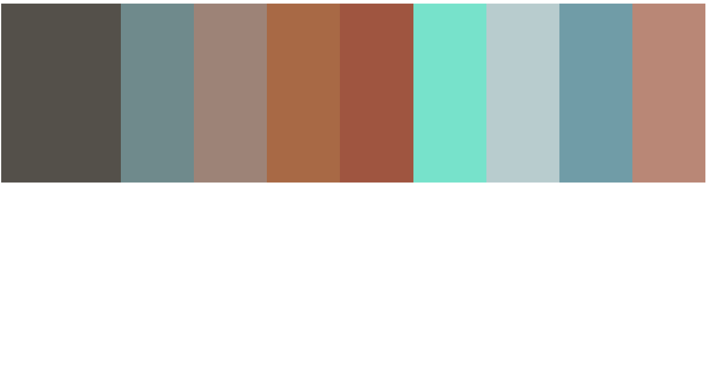
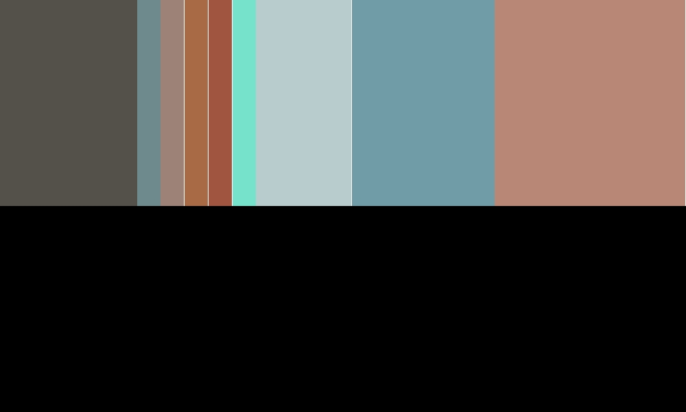

# 实现的功能

### `DOM` 部分：

可以从服务器获取 HTML 代码，并进行解析：

支持的格式：

```html
document		  ==> 最外层包裹了一个 document 	
<div></div>       ==> 标签全部定义为 element
"   "             ==> 文字全部定义为 text

<style></style>   ===> 其内容代码会被 CSS Compute 识别并解析
```


提取 DOM 中一个节点的结构：

依次是：

- 节点类型
- 子节点
- 节点属性
- 节点标签名
- 节点已计算的CSS属性
- 父节点
- 节点的 CSS 属性

```js
{
  "type": "element",
  "children": [],
  "attributes": [{ "name": "id", "value": "myid"}],
  "tagName": "div",
  "computedStyle": {
    "width": {
      "value": "200px",
      "specificity": [0,2,0,0]
    },
    "height": {
        "value": "300px",
        "specificity": [0,2,0,0]
    },
    "background-color": {
        "value": "rgb(84,80,74)",
        "specificity": [0,2,0,0]
    }
  },
  "parent": {
    "tageName": "div",
    "type": "element"
  },
  "style": {
    "width": 200,
    "height": 300,
    "background-color": "rgb(84,80,74)",
    "left": 0,
    "right": 200,
    "top": 0,
    "bottom": 300
  }
},
```


### `CSS` 部分：

实现了：`computed CSS`：

通过对每一个 CSS 规则进行 权重 `specificity` 计算，比较应用哪一个 CSS 规则；


可以识别：

- `width`、`height`
- 单位：`px`、`number`


### `Flex` 部分：

- 主轴 Main Axis 的确定：
  - `flex-direction`: row、column

```js
// 	确定 main 主轴，以及计算位置时需要考虑的变量：
  // mainSize 主轴尺寸
  // mainStart， mainEnd 主轴的边界（包含了方向问题）
  // mainSign 表示从左往右排，从右往左排时的符号，正负1
  // mainBase 从左/从右开始
  // cross 交叉轴同理
  let mainSize,
    mainStart,
    mainEnd,
    mainSign,
    mainBase,
	crossSize,
    crossStart,
    crossEnd,
    crossSign,
    crossBase;
```

- 计算主轴是否允许折行，如果折行需要进行剩余空间的分配；如果不允许需要利用 flex item 的 `flex` 属性确定压缩比例。
  - 计算主轴和交叉轴的剩余空间，并通过属性判断剩余空间的处理方式；
  - 父容器的 `justifyContent` 属性去决定主轴剩余空间的排布。
    - `flex-start`, `flex-end`, `center`,     `space-between`, `space-around`, `space-evenly`。


- 交叉轴：计算主轴每一行的行高，行高的剩余空间如何处理：
  - 就根据 `align-content` 判断如何分配剩余空间：
    - `start`、 `center`、`space-between`、`space-around`、`stretch` 
  - 行高 `flex-align` 和 `item-align`，确定单个元素的具体位置：
    - `align-self` ：`stretch`、`center`、`start`、`end`，拉伸以填满高度、居中、顶部、底部
    - `align-items`：与 `self` 不同 `items` 是直接定义父 flex 容器盒子上的，一次性修改全部的 flex item。
    - `self` 的优先级更高，指定的范围更小。


`Layout` 部分，左侧是代码中定义的属性，右侧是 CSS Flex 的正确名称。

实现了对 DOM 元素 的 Flex 布局：

- `flexDirection`：同 `flex-direction`
- `alignContent`：同 `align-content`
- `alignItems`：同 `align-item`
- `justifyContent`：同 `justify-content`
- `flexWrap`：同 `flex-wrap`，属性有：auto、nowrap


# 测试：

## t1

```html
<html maaa=a>
    <head>
        <style>
            #container {
                width: 1000px
                height: 800px;
                display: flex;
                background-color: rgb(255,255,255);
            }
            #container #myid {
                width: 200px;
                height: 300px;
                background-color: rgb(84,80,74);
            }
            #container .c1 {
                flex: 1;
                background-color: rgb(111,138,140);
            }
            #container .c2 {
                flex: 1;
                background-color: rgb(157,131,119);
            }
            #container .c3 {
                flex: 1;
                background-color: rgb(168,105,69);
            }
            #container .c4 {
                flex: 1;
                background-color: rgb(159,85,64);
            }
            #container .c5 {
                flex: 1;
                background-color: rgb(119,226,203);
            }
            #container .c6 {
                flex: 1;
                background-color: rgb(184,204,206);
            }
            #container .c7 {
                flex: 1;
                background-color: rgb(112,156,167);
            }
            #container .c8 {
                flex: 1;
                background-color: rgb(185,135,118);
            }
        </style>
    </head>
    <body>
        <div id="container">
            <div id="myid"></div>
            <div class="c1"></div>
            <div class="c2"></div>
            <div class="c3"></div>
            <div class="c4"></div>
            <div class="c5"></div>
            <div class="c6"></div>
            <div class="c7"></div>
            <div class="c8"></div>
        </div>
    </body>
</html>
```

toy browser render：


chrome render：




## t2 测试 flex 比例缩小

`html` 代码没变，只改变了 css 大小

```css
#container {
    width: 1000px
    height: 800px;
    display: flex;
    background-color: rgb(255,255,255);
}
#container #myid {
    width: 200px;
    height: 300px;
    background-color: rgb(84,80,74);
}
#container .c1 {
    flex: 1;
    background-color: rgb(111,138,140);
}
#container .c2 {
    flex: 1;
    background-color: rgb(157,131,119);
}
#container .c3 {
    flex: 1;
    background-color: rgb(168,105,69);
}
#container .c4 {
    flex: 1;
    background-color: rgb(159,85,64);
}
#container .c5 {
    flex: 1;
    background-color: rgb(119,226,203);
}
#container .c6 {
    flex: 4;
    background-color: rgb(184,204,206);
}
#container .c7 {
    flex: 6;
    background-color: rgb(112,156,167);
}
#container .c8 {
    flex: 8;
    background-color: rgb(185,135,118);
}
```

toy browser render：



chrome render：


## t3

```html
<html maaa=a>
<head>
    <style>
        #container {
            width: 1000px
            height: 800px;
            display: flex;
            background-color: rgb(255,255,255);
        }
        #container #myid {
            width: 200px;
            height: 300px;
            background-color: rgb(84,80,74);
        }
        #container .c1 {
            flex: 1;
            background-color: rgb(111,138,140);
        }
        #container .c2 {
          width: 300px;
          height: 150px;
          background-color: rgb(157,131,119);
        }
        #container .c3 {
            flex: 1;
            background-color: rgb(168,105,69);
        }
        #container .c4 {
            flex: 5;
            background-color: rgb(159,85,64);
        }
        #container .c5 {
          width: 200px;
          height: 400px;
            background-color: rgb(119,226,203);
        }
        #container .c6 {
          width: 80px;
          height: 500px;
          background-color: rgb(184,204,206);
        }
        #container .c7 {
            flex: 1;
            background-color: rgb(112,156,167);
        }
        #container .c8 {
            flex: 3;
            background-color: rgb(185,135,118);
        }
    </style>
</head>
<body>
    <div id="container">
        <div id="myid"></div>
        <div class="c1"></div>
        <div class="c2"></div>
        <div class="c3"></div>
        <div class="c4"></div>
        <div class="c5"></div>
        <div class="c6"></div>
        <div class="c7"></div>
        <div class="c8"></div>
    </div>
</body>
</html>
```

toy browser render：


chrome render：


