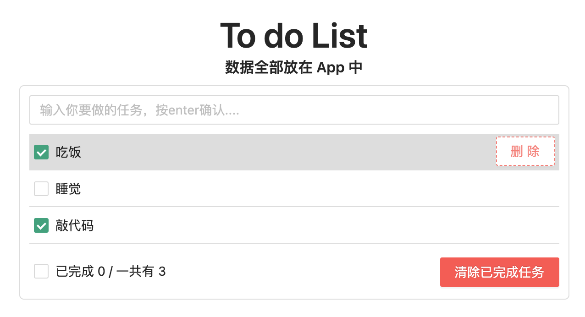
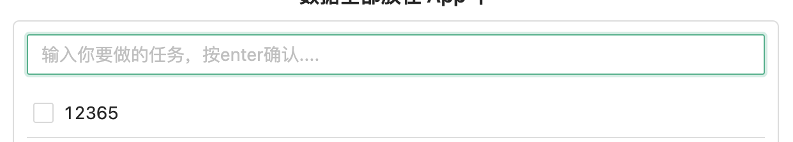

# 用 react 制作一个todolist

## 1 环境搭建

-   create-react-app 创建 react 脚手架
-   删除不需要的文件：

-   在 public 中，创建 index.html
-   在 src 中，创建 App.jsx、index.jsx

index.html 是最终展示页面的地址，是主页，有一个id= "root"的入口 div，react 最终会在这里渲染页面 。

index.jsx，引入：react、reeact-dom、App 组建后，这里作为React渲染主组件 App 的入口，将所有组件内容渲染到 index.html 的 root div 中。

App.jsx：是页面最外层的组件，所有组件的祖先组件，也就是说剩下的所有组件都放到 App 的内层中。

引入：Antd，按照官方文档进行按需引入

## 2 构建基本组件结构

Components下，有Header、Footer、List、Item四个组件。

## 3 Item中，显示/隐藏某元素

1.   在组件中，设置一个 flag： `state={mouse: false}`。
2.   当鼠标移动到/移动出某个选项中，触发 OnMouseEnter 和 OnMouseLeave 事件，此时加入时间回调，修改 flag 为 true/false。
3.   最后，在 Item 和 删除选项添加 `style={{}}` 增加一个三目运算符
     1.   变灰色选项：`style={{ backgroundColor: mouse ? "#ddd" : "white"}}`
     2.   删除按钮：`style={{ display: mouse ? "block" : "none" }}`

#### 数组间通信的第一种方式：

-   把公共数据全部放在共同的祖先组件中，是 `App` 。

#### 如何在 list 中遍历所有数据，变成一个个 item？

1.   从 state 中获取所有数据（一个数组）；

2.   利用 map 遍历数组。数组中每个元素都会被执行一次回调函数。

     ​	`myArr.map((currentValue, index, arr) => {...})`

     -   map 函数会返回一个新数组，回调函数的返回值，会作为这个新数组的元素，放入其中。

#### 如何根据一个 id ，删除列表中已完成的事情？

1.   利用 fliter 遍历数组。数字中每个元素都会被执行一次回调函数。
     1.   回调函数的返回值 `return true` 则表示留下该元素，返回 false 则表示删除该元素。
2.   最终会返回一个新数组。

⚠️ `setState()`更新 state 状态需要注意的常识：

-   不能在原有数据上直接操作后返回。需要创建一个新数组，然后把新数组更新到 state 上。一个常见的添加数组的方法，不是利用 push unshift ，而是利用 [newElem, ...arr] 这个方式。这样会创建一个新数组。

#### 尚不明确：使用 Antd 的 input组件后，无法利用event.terget.value="" 清空内容。

-   解决方案，其实没解决，利用 ref 获取input地址，然后用 this.inputValue.state.value="" 清空。

#### 在 Footer 计算已完成的总数：

利用 myArray.reduce()方法。该方法会对每个元素执行一次回调函数。可以利用该方法对一组数组中所有元素值求和。方法的每次回调的 return值，都会作为 prevValue 传递给下一个回调函数。最后一个回调函数执行后，会把结果return。

 

#### 如何实现当事件全部勾选，最下放 Footer 的勾选框也会跟着勾选？

 

在最下方的 Checkbox 中，checked 判断一下 “已完成” 和 “一共有” 是否相等即可。

`checked={finished === total && total !== 0}`

#### to do list

-   需要补充 CSS 的相关知识，忘记的太多了。
-   样式要自己根据 CSS 规则，进行 1 比 1的还原。

to do list 还有很多地方需要添加：

-   比如弹性界面已适应移动端；
-   鼠标按住左键，拖动滑过多个 item 后，可以全部选中；
-   为 item 添加一个时间控件，可以选择持续时间。
-   界面上可以模仿苹果的待办事项。

